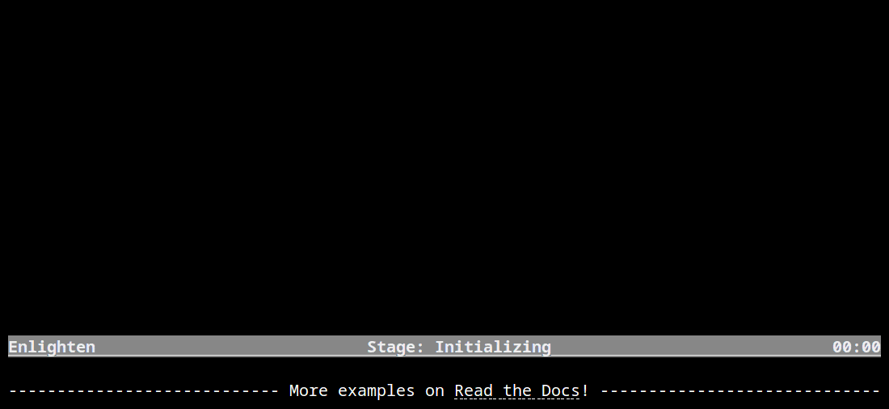

..
  Copyright 2017 - 2021 Avram Lubkin, All Rights Reserved

  This Source Code Form is subject to the terms of the Mozilla Public
  License, v. 2.0. If a copy of the MPL was not distributed with this
  file, You can obtain one at http://mozilla.org/MPL/2.0/.

:github_url: https://github.com/Rockhopper-Technologies/enlighten

.. toctree::
   :hidden:

   self
   install.rst
   examples.rst
   patterns.rst
   faq.rst
   api.rst

Overview
========

Enlighten Progress Bar is a console progress bar library for Python.

The main advantage of Enlighten is it allows writing to stdout and stderr without any
redirection or additional code. Just print or log as you normally would.

Enlighten also includes experimental support for Jupyter Notebooks.

The code for this animation can be found in
`demo.py <https://github.com/Rockhopper-Technologies/enlighten/blob/master/examples/demo.py>`__
in
`examples <https://github.com/Rockhopper-Technologies/enlighten/tree/master/examples>`__.